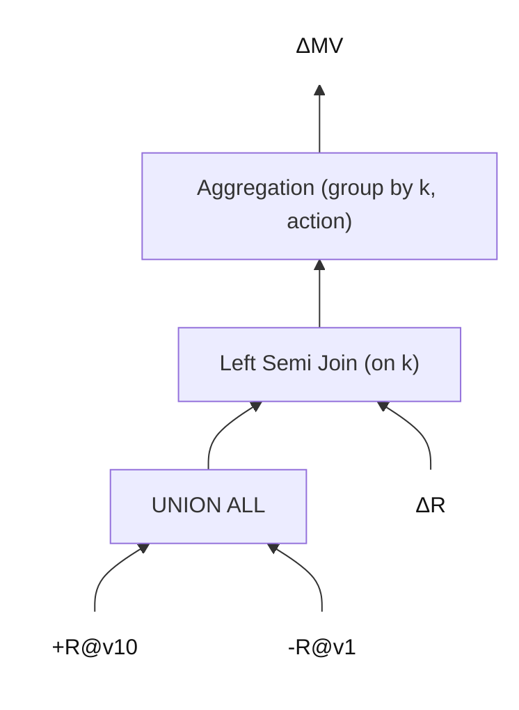

# 目标
## 总目标
实现对内表 OlapTable 的增量物化视图（IVM, Incremental Materialized View）的支持。

支持对基表的 DELETE、INSERT、UPDATE 操作的增量维护。

# 前置需求
## OlapTable 读取多版本

### 目标
给定一个 OlapTable，维护 base_version 和 head_version。
- FE metadata 可以读取 `[base_version, head_version]` 每个版本的元数据，用于查询。
- BE 上，>=base_version 的版本数据都保留在 BE 上，供查询使用，不能被 compaction 掉。

为了测试方便，增加几个命令：
- ALTER TABLE <table_name> SET BASE_VERSION = x
- SQL 中 `FROM table_name VERSION(x)` 来指定版本读取。
- SHOW VERSIONS FROM table_name 来显示所有版本信息。

### 已实现的 base_version 相关能力
目前已落地的命令/能力（按当前实现范围）：

1. **设置 base_version**  
   `ALTER TABLE <table_name> SET ("base_version" = "<x>")`

2. **指定读取版本**  
   `SELECT ... FROM <table_name> VERSION(x)`  
   FE 做范围校验并下传到 BE。

3. **查看版本信息**  
   `SHOW VERSIONS FROM <table_name>`  
   输出 `DbName / TableName / PartitionName / PhysicalPartitionId / VisibleVersion / BaseVersion`。

同时，BE 侧的版本保留策略已覆盖：
- **Primary/Unique Key（updatable）表**：`TabletUpdates::remove_expired_versions` 按 base_version 保留。
- **Duplicate Key 表**：`Tablet::delete_expired_stale_rowset` 加入 base_version 保留逻辑。
- **Lake（存算分离）表**：FE 在 vacuum 请求的 `retain_versions` 中加入 base_version，避免 vacuum 删除。


### 简易支持
**如果只是“走通流程”的 query-only IVM**，最小化可行条件是：

1. **禁用迁移/重平衡**  
   让 tablet 不变动位置，避免“新位置只有最新版本”的问题。

2. **禁用旧版本清理**  
   让 `>= base_version` 的版本一直保留在 BE。

3. FE 只做：  
   - `base_version` 存储/设置  
   - `VERSION(x)` 语法 + 下传版本号  
   - 基本范围校验（`x <= visibleVersion`、`x >= base_version`）

如果你确认这是一个**受控测试环境**，这条路线是合理的。

你要我帮你确认具体哪些 BE 配置可以关掉迁移/清理吗？

### 关闭负载均衡的配置（建议组合）
如需在测试环境中**尽可能关闭负载均衡/迁移**，建议同时设置：

1. `tablet_sched_disable_balance=true`  
   关闭 FE TabletScheduler 的 balance 调度，同时同步到 StarMgr 关闭后台 shard 负载均衡检查。

2. `tablet_sched_disable_colocate_balance=true`  
   关闭 colocate 表的自动平衡。

3. `lake_enable_balance_tablets_between_workers=false`  
   关闭存算分离（Lake）场景下的 worker 间 tablet 平衡。

说明：
- 上述配置主要关闭“均衡/迁移”类行为，**不等同于**关闭异常修复类调度（如副本丢失修复）。
- 如果你还希望禁用异常修复调度，需要再明确范围与目标行为。


## 读取基表 Changes

### 简易支持

给定两个 version v1 和 v2，能够读取 OlapTable 在这两个版本之间的变化（changes）。

返回格式中，增加一列 `action` 类型为 SMALLINT，值为 +1 和 -1，分别表示 INSERT 和 DELETE。UPDATE 拆分为 DELETE + INSERT。

为了测试方便，增加一个命令：
- `SELECT ... FROM table_name CHANGES BETWEEN v1 AND v2` 来指定版本范围读取变化。

支持范围
- Duplicate Key 表：只支持 INSERT。
- Primary Key 表：支持 INSERT、DELETE、UPDATE（拆分为 DELETE + INSERT）。

# 设计

## 一、总体流程

1. 创建 MV 时，通过 analyzer 判断 MV 是否可以增量维护。如果满足条件标记为“可增量”。需要满足的条件包括：
   1. MV 指定的刷新模式是 IVM。
   2. 整个 MV 的 plan 所有算子都支持增量维护。
2. MV 刷新时，决策使用的刷新模式。
   - MV 必须被标记为“可增量”。
   - 如果刷新模式为 IVM，那么使用增量维护。
   - ~~如果刷新模式为 AUTO，那么根据启发式策略来决定使用增量刷新还是全量刷新 (暂时不考虑这一点)~~：
      - ~~增量刷新 plan 与全量刷新 plan 的 cost 对比。~~
3. 对于增量刷新，生成增量维护 plan。
4. 调度执行增量维护 plan，并更新 MV 的版本信息。

## 二、主要细节

目标是新增一套**完全独立**于当前 TVR/IVM 的增量改写框架，专门面向 `OlapScanOperator`。

### 设计约束（必须满足）
1. 不复用、不修改现有 `rule/tvr/*` 与当前 IVM 执行链路。
2. 新框架独立包名、独立 RuleType、独立 RuleSet 组合。
3. 默认关闭，通过独立 session 变量或 task 级开关启用。
4. 只在 MV 刷新场景触发；失败时严格回退全量，不影响原有 plan 生成。

### 推荐代码组织
建议新增目录（示例）：
- `fe/fe-core/src/main/java/com/starrocks/sql/optimizer/rule/ivm/`
- `fe/fe-core/src/main/java/com/starrocks/sql/optimizer/rule/ivm/common/`
- `fe/fe-core/src/main/java/com/starrocks/sql/optimizer/operator/logical/LogicalDeltaOperator.java`

核心组件：
- `IvmOlapRewriteCoordinator`：编排总流程（ROW_ID 推导 + Delta 改写 + 成功判定）。
- `IvmRowIdDeriveRule`：ROW_ID 两阶段规则（Collector + Rewriter）。
- `IvmDeltaPushDownRules`：Delta 下推规则集合（每个算子一个 rule）。
- `IvmRewriteContext`：本次改写上下文（ROW_ID 定义、失败原因、版本边界、列映射）。

### 1. ROW_ID 推导（独立 TransformationRule）

逻辑：从叶子节点（`OlapScanOperator`）自下而上推导每个算子的 ROW_ID 定义。

实现分两阶段：
1. Collector（自底向上）
   - 输入：原始 `OptExpression`。
   - 输出：`Map<OptExpression, RowIdSpec>`。
   - 作用：记录每个算子的 ROW_ID 定义；发现不支持算子时写入 `IvmUnsupportedReason`。
2. Rewriter（自顶向下）
   - 输入：Collector 的 context。
   - 输出：新 `OptExpression`（仅增量路径使用）。
   - 作用：在必要位置把 ROW_ID 列注入输出。
   - 约束：必须创建新的 `Operator` 与 `OptExpression`，保持原 plan 不变。

`RowIdSpec` 建议抽象为：
- `UNDEFINED`：未定义（不支持增量）。
- `PASSTHROUGH(childIndex)`：直接继承子节点 ROW_ID（如 Filter/Project）。
- `EXPR(List<ScalarOperator>)`：由表达式定义（如 GroupByKey）。

### 2. 增量维护 plan 生成（DeltaOperator 驱动）

主流程：
1. 在根节点包一层 `LogicalDeltaOperator`，表示“该子树需要生成 delta plan”。
2. 定义一组 `DeltaPushDownRule`，把 `Delta(X)` 改写为对应算子的增量形态，并继续把 Delta 下推到子节点。
3. 处理 `OlapScanOperator`：
   - changes 读取：`from_version = flushed_version`，`to_version = latest_visible_version`。
   - version 读取：按具体 rule 选择 `flushed_version` 或 `latest_visible_version`。
4. 使用 `scheduler.rewriteIterative` 反复应用规则。
5. 收敛判定：若最终 plan 不再含 `LogicalDeltaOperator`，则增量改写成功；否则失败并回退全量刷新。

### 3. 不影响现有 TVR/IVM 的接入方式

接入点建议：
1. 在 `QueryOptimizer` 增加独立分支（例如在现有 TVR rewrite 之前或之后），仅在 `enable_olap_ivm_refresh=true` 且 `isMVRefresh=true` 时执行。
2. 使用新的规则集合常量（例如 `RuleSet.OLAP_IVM_ROWID_RULES`、`RuleSet.OLAP_IVM_DELTA_RULES`），禁止并入 `RuleSet.TVR_REWRITE_RULES`。
3. 新增 `RuleType` 前缀（例如 `TF_OLAP_IVM_*`），避免和 `TF_TVR_*` 混淆。
4. 若任一步失败，仅记录日志并返回“本次不支持增量”，后续走全量路径。

### 4. 可扩展性约定

1. 每新增一个逻辑算子，仅需补两处：
   - `RowIdCollector/RowIdRewriter` 对该算子的 ROW_ID 规则。
   - `DeltaPushDownRule` 对该算子的 Delta 改写。
2. 所有“不支持增量”的判断统一走 `IvmUnsupportedReason`，禁止直接抛散乱异常。
3. 每个 rule 保持单一职责，避免“大一统 rule”。
4. 测试按层次拆分：ROW_ID 推导 UT、Delta 规则 UT、端到端改写 UT。


问题
- ~~由于统计信息并不支持 changes，因此我们需要自己手动指定 join 顺序，在 rule 中生成 join 的时候。例如把 changes 放到右侧。~~

## 实现过程

## 1. Scan + Project + Filter 的增量维护

### ROW_ID 推导
- Project 算子：ROW_ID 定义为它的输入算子的 ROW_ID。
- Filter 算子：ROW_ID 定义为它的输入算子的 ROW_ID。
- Scan 算子：ROW_ID 定义为基表的主键值。只支持主键表。

### 增量维护 plan 的生成
Scan、Project、Filter 是 linear operator，直接用算子本身就可以了。


## 2. Group-by Aggregation 的增量维护
然后，我们实现 group-by aggregation。

### ROW_ID 推导
对于 group-by aggregation 来说，ROW_ID 定义为 group by key 的值。对于基表 R 上的 group by `key`，ROW_ID 定义为 R.key。

### 增量维护 plan 的生成

实现方式，对于基表 R，以及 group by `key`、聚合函数 `f`，我们这样去改写一个增量算子：
  - 在旧版 R 与新版 R 上读取受影响的 key (affected_key) 的所有行，重新计算算子 `f` 的结果，减掉旧结果，加上新结果。

举个例子，对于下面的 Aggregation MV 示例，转化为的普通算子组合如 mermaid 图所示。
```sql
SELECT k, count(1) as cnt FROM R GROUP BY k;
```



## 3. 将 changes 写入 Primary Key Table

### 目标
把 `CHANGES` 读取出来的 `__ACTION__`（`+1/-1`）转换成 Primary Key 表可识别的操作列，一次导入同时支持 UPSERT 和 DELETE。

### 结论
Primary Key 表支持在一次导入中通过 `__op` 指定行级操作：
- `__op = 0` 表示 UPSERT
- `__op = 1` 表示 DELETE

因此可以直接把 `__ACTION__` 映射到 `__op`：
- `__ACTION__ = -1` -> `__op = 1`
- `__ACTION__ = +1` -> `__op = 0`

### 实现约定
1. `__ACTION__` 仅作为增量维护中的中间列，不落到目标 MV schema。
2. 在写入 PK sink 前追加最后一列 `__op`（TINYINT）。
3. `__op` 的表达式统一使用：

```sql
CASE WHEN __ACTION__ < 0 THEN 1 ELSE 0 END
```

4. 对于 Duplicate Key 表，不使用 `__op`，忽略 `-1`（或在分析阶段禁止产生 `-1` changes）。

### 示例（逻辑形态）

```sql
INSERT INTO mv_pk (...)
SELECT
  ...,
  CASE WHEN __ACTION__ < 0 THEN 1 ELSE 0 END AS __op
FROM delta_plan;
```
