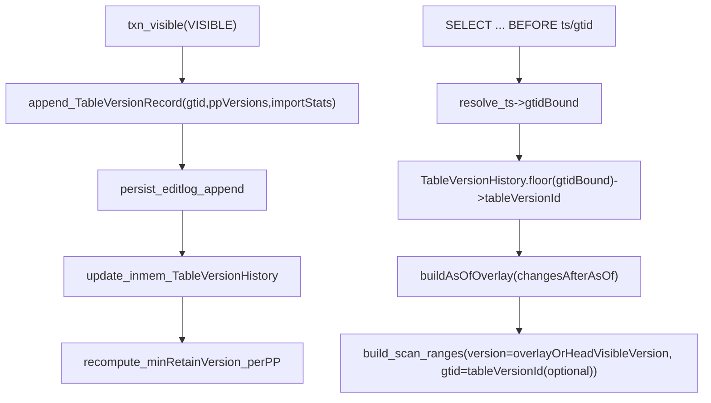

# Shared-Data：4.3.1 最小实现方案（MVCC + TableVersion(GTID) + 最小 Timestamp Query）实现设计文档

> 目的：给另一个 AI agent 作为“进一步实现设计”的唯一输入文档，明确方向、边界、落点与持久化方案  
> 约束：**不引入/不对外暴露 TVR 概念**；TableVersion 仅做最简闭环（写入记录、读路径按版本读取、窗口保留、断链降级、可持久化）

---

## 背景与目标

- **背景（Shared-Data/Lake 表）**：FE 以 `PhysicalPartition.visibleVersion` 表示分区可见版本；当前读路径默认读最新可见版本。4.3.1 需要支持 IVM 的 `base/head` 两个一致性读取点；同时要求实现一个**最小化 timestamp 查询**。
- **目标**
  - **TableVersion（最小）**：引入“表级一致性版本”的 MVCC 语义，用于把一次 publish 的结果抽象成一个可引用的 `TableVersionId`，并能恢复出每个 PhysicalPartition 在该时间点的 `visibleVersion`。
  - **TableVersionId = GTID**：复用 `TransactionState.globalTransactionId`（GTID）作为 TableVersionId；并明确：未来可扩展为 **DDL 也分配 GTID（每个 DDL 一个 GTID）**。
  - **记录时机**：在导入/事务 **publish 成功并对外可见（VISIBLE）**时记录版本；记录内容不仅包含可见版本，还包含**导入统计信息（数据量等）**。
  - **不记录 publishTimeMs**：GTID 本身包含 timestamp 位段，作为时间指针。

---

## 范围与非目标（最小实现必须遵守）

- **范围（本期必须做）**
  - 仅针对 **Shared-Data（CloudNative）表**：`table.isCloudNativeTableOrMaterializedView()`。
  - 最小 timestamp query：支持常量时间点，落在保留窗口内；超出窗口/断链直接报错。
  - IVM：能拿到 base/head 两个 TableVersionId（GTID），并能按这两个版本做一致性读（最小先做到“按版本读 snapshot”；delta 优化可后置）。
  - **持久化**：TableVersionHistory 必须能持久化到 **image**，并通过 **edit log** 增量持久化，保证重启/故障恢复后语义不漂移。
- **非目标（本期明确不做）**
  - 不做“完整 Time Travel”（跨长期历史、跨 schema/topology 演进、任意 DDL 历史查询）。
  - 不做历史 schema / tablet topology 的版本化管理；遇到拓扑破坏类操作一律视为断链。
  - 不引入/不依赖 `MetadataMgr.getTableVersionRange()` 这条 TVR/connector 版本链路。

---

## 核心概念定义（MVCC 语义）

- **TableVersionId**：本期等同 GTID（64-bit），单调递增，包含时间戳位段。
- **TableVersionRecord**：一次 publish(VISIBLE) 产出一条记录，描述该 publish 对哪些 PhysicalPartition 的 `visibleVersion` 产生了怎样的变化 + importStats。
- **TableVersionHistory**：每张表一个短窗口历史（按时间/条数界定），支持：
  - `floor(tableVersionId)`：找最近的 `<=` 目标 id 的版本；
  - `buildAsOfOverlay(tableVersionId)`：构建“as-of 覆写表（overlay）”，仅包含 **as-of 之后发生变更**的 `ppId -> asOfVisibleVersion`；规划 scan range 时用 `overlay.getOrDefault(ppId, headVisibleVersion)` 得到最终版本（见“数据结构与算法”）。
- **ChainBreak（断链）**：任何会破坏版本连续链路、导致旧版本不可安全读取的事件（TRUNCATE、DROP PARTITION、schema change/rollup、reshard 等）。断链后 timestamp query 报错、IVM 降级 full refresh。

---

## 现状锚点（实现必须利用的现有链路）

- **GTID 编码与生成**
  - `com.starrocks.transaction.GtidGenerator` 编码了 timestamp 位段，并提供 `getGtid(timestampMs)`。
  - `com.starrocks.transaction.DatabaseTransactionMgr` 在事务 COMMITTED 阶段分配 `globalTransactionId`（GTID）。
- **SQL 到扫描的 gtid 传递链路（已存在）**
  - Parser `BEFORE 'ts'` 会写入 `TableRelation.gtid`（已能 parse ts->gtid）。
  - Optimizer/Planner 会把 `TableRelation.gtid` 下推到 `LogicalOlapScanOperator.setGtid(...)`，最终进入 FE `OlapScanNode`，并写入 `TInternalScanRange.gtid`。
- **关键：Shared-Data 真正决定读哪个版本的是 `internal_scan_range.version`**
  - 当前 `OlapScanNode.addScanRangeLocations()` 对 CloudNative 仍然把 `version` 设为 `physicalPartition.getVisibleVersion()`，所以仅仅传 gtid 并不会实现“时间点读”；必须把 `version` 改为 as-of 的 visibleVersion。

---

## 总体架构（写入记录 + 解析时间点 + 规划按版本读）



---

## 数据模型（建议落地形态）

### 1) TableVersionRecord（一次 publish 一条）

- `tableId`
- `tableVersionId`（GTID）
- `changedPhysicalPartitions`：**强烈建议用稀疏 delta**（仅记录本次事务实际触碰的 PhysicalPartition），并优先采用**并行 primitive 数组**而不是 `Map<Long, ...>`，以降低对象数与装箱开销：
  - `ppIds[]`：`long[]`
  - `prevVisibleVersions[]`：`long[]`
  - `newVisibleVersions[]`：`long[]`
  - （可选，诊断字段）`prevVersionEpochs[]/newVersionEpochs[]`：仅在需要定位 epoch 异常/断链排障时保留；否则可省略以进一步降内存
- `importStats`（可稀疏）：从 `TxnCommitAttachment` 提取（rows/bytes/filtered/received 等）
- `flags`：如 `chainBreakMarker`（可选）

### 2) TableVersionHistory（短窗口）

- **持久化字段（必须 `@SerializedName`）**
  - `records`（按时间/GTID 单调追加）
  - `retentionPolicy`（窗口策略：maxAgeMs/maxRecords 等）
  - `lastChainBreak`（可选：断链原因与 GTID）
- **非持久化派生结构（不加 `@SerializedName`，load 后重建）**
  - `floor` 索引：**不建议**使用 `TreeMap<Long, Integer>` 这类重索引结构；`records` 本身按 GTID 有序，直接二分即可（见 3.2）
  - per-query 临时结构：用于“按 as-of 版本读”的覆写表（overlay），建议用 primitive map（仅存被回滚影响到的 pp）

### 3) 数据结构与算法（优化版，降低内存与计算复杂度）

> 目标：在 4.3.1 “短窗口 + 稀疏变更”假设下，避免 **TreeMap/HashMap 装箱**与 **每次查询 O(windowSize) 正向回放**。

#### 3.1 关键设计点（推荐默认）

- **不持久化任何索引/快照**：`records` + `pp delta arrays` 是唯一真相；派生结构只在内存/单次查询里构建。
- **floor 用二分**：`records` 天然按 `tableVersionId(GTID)` 单调追加，直接二分定位 floor。
- **as-of 不做全量 snapshot copy**：从“当前可见版本（head）”出发，只构建“需要回滚的 pp 覆写表（overlay）”，在 `OlapScanNode` 规划 scan range 时按 pp 查询覆写表即可。
- **尽量让“复杂度 ∝ 实际变更量”**：record 只存触碰的 pp；as-of 只回滚 as-of 之后触碰过的 pp。

#### 3.2 `floor(gtidBound)`：O(log n)，无 TreeMap

`records` 有序，二分得到 floor 的下标 `idx`（实现细节）；对外返回 `records[idx].tableVersionId`（或 null）：

```text
input:  gtidBound (long)
output: tableVersionId (long) 或 null

lo = 0, hi = records.size - 1
ans = -1
while lo <= hi:
  mid = (lo + hi) >>> 1
  if records[mid].tableVersionId <= gtidBound:
     ans = mid; lo = mid + 1
  else:
     hi = mid - 1
if ans == -1: return null
return records[ans].tableVersionId
```

复杂度与内存：

- **时间**：O(log n)
- **额外内存**：0（不需要 `gtidIndex`）

#### 3.3 as-of 可见版本解析：reverse overlay，O(Δ)

核心思想：**当前规划阶段已经能拿到每个 `PhysicalPartition` 的 head `visibleVersion`**（即 `physicalPartition.getVisibleVersion()`）。要回到 as-of，只需要把 as-of 之后发生过变更的 pp “回滚”到它们的 `prevVisibleVersion`。

1) 构建 overlay（仅含需要回滚的 pp）：

```text
input:  tableVersionId (long), records[0..N-1]
output: overlay: ppId -> asOfVisibleVersion (仅覆盖受影响 pp)

targetIdx = floorIndex(tableVersionId)   // 复用 3.2 的二分（或在 buildAsOfOverlay 内部直接得到 idx）
overlay = empty map<long,long>
for i from N-1 downTo targetIdx+1:
  for each changed entry j in records[i]:
     pp = ppIds[j]
     overlay[pp] = prevVisibleVersions[j]   // 允许重复覆写：逐步回滚多次变更
```

2) 在 `OlapScanNode.addScanRangeLocations()` 的 partition 循环里取 as-of 版本：

```text
head = physicalPartition.getVisibleVersion()
asOf = overlay.contains(ppId) ? overlay[ppId] : head
internalRange.version = asOf
```

复杂度与内存（Δ = as-of 之后所有记录的变更条目总数）：

- **时间**：O(Δ) 构建 overlay；规划 scan range 自身仍是 O(#pp)（本来就需要遍历）
- **额外内存**：O(#distinct pp changed after as-of)，通常远小于全表 pp 数

> 对比“正向 materializeSnapshot(0..targetIdx)”：当 as-of 接近 head（IVM/实时场景最常见）时，reverse overlay 把成本从 O(windowSize) 降到 O(最近变更量)。

#### 3.4 `trimWindow()`：避免 `ArrayList.remove(0)` 的 O(n)

`records` 作为持久化字段通常会用 `ArrayList`。若每次超过 `maxRecords` 都做 `remove(0)`，在高频写入时会出现 **O(n) 搬移**。

推荐两种实现（按实现复杂度递增）：

- **默认（简单且足够）**：仍用 `ArrayList`，但新增一个 `startOffset`（transient）表示逻辑窗口起点；当 `startOffset` 累积到一定阈值（例如 1024）再做一次 `subList` compact。
- **可选（更优）**：使用 ring-buffer/`ArrayDeque` 表示窗口，序列化到 image 时再导出为紧凑 list（实现稍复杂，但能把 trim 成本稳定在 O(1)）。

保留策略的“按时间”判断不需要额外字段：GTID 自带 timestamp 位段，可由
\(ts\_ms = (gtid >> TIMESTAMP\_SHIFT) + GtidGenerator.EPOCH\) 推出。

#### 3.5 `minRetainVersion`：两种策略（精确 vs 低开销）

`minRetainVersion` 的目标是保护**窗口内最早可查询版本**不被 vacuum 清理。这里给出两种策略：

- **策略 A（推荐，低开销，允许更保守的保留）**
  - 维护一个 transient `windowStartVersions`（ppId -> visibleVersion@windowStart）的 primitive map，仅覆盖“窗口内至少变更过一次的 pp”
  - **appendRecord 时增量填充**：对每个 changed pp，若 `windowStartVersions` 里还没有该 pp，则：
    - 若这是窗口第一条 record：写入 `newVisibleVersion`（窗口最早可查询版本就是该 record）
    - 否则写入 `prevVisibleVersion`（该 pp 在窗口开始时的版本）
  - **trimWindow 前移窗口起点时增量推进**：当窗口丢弃最旧 record 后，新窗口起点变为 `records[0]`，对其 changed pp 写入 `newVisibleVersion`（把窗口起点快照推进到新 record 对应的版本）
  - 回填到 `PhysicalPartition.minRetainVersion` 时，只需要遍历 `windowStartVersions` 的 key 集合（无需全表扫描）
  - **优点**：每条 record 的 CPU 成本约为 O(#changed pp)，无全量回放
  - **代价**：如果不做“清理已不再需要的 key/minRetainVersion”，会出现 **GC 更保守**（保留略多），但不影响正确性

- **策略 B（可选，精确但更贵）**
  - 在窗口滑动时，使用 3.3 的 reverse overlay 计算 `records[0]` 对应 as-of，再把该 as-of 作为精确的 `minRetainVersion`
  - **优点**：保留更精确
  - **代价**：滑窗频繁时可能产生 O(Δ) 级别额外开销（Δ 与窗口内总变更量相关）

#### 3.6 可选方案（按需启用）

- **方案 1：as-of overlay LRU cache**  
  对“重复查询同一 as-of（或 IVM base/head）”场景，缓存 `gtid -> overlay`（或缓存 `gtid -> resolved floor idx`），用大小/TTL 控制内存上限。

- **方案 2：checkpoint snapshot（以空间换时间）**  
  每 N 条 record 记录一个 checkpoint（ppId->visibleVersion 的紧凑快照），as-of 时从最近 checkpoint 回放 delta；适合窗口较大且 as-of 分布较散的场景。

- **方案 3：per-pp timeline（查询更稳）**  
  以 pp 为维度维护 `[(gtid, visibleVersion)]` 的追加序列，as-of 通过对每个 pp 做 floor 查找得到版本；适合 pp 数较小但窗口很大、且每条 record 变更 pp 很少的场景（实现更复杂、内存模型不同）。

---

## 写路径：记录 TableVersion + importStats（以及增量持久化）

### 触发点

- 在事务完成 publish 并进入 **VISIBLE** 后、且 FE 已更新 `PhysicalPartition.visibleVersion` 的位置追加记录（例如 `DatabaseTransactionMgr.finishTransaction()` 在 `updateCatalogAfterVisible(...)` 之后）。

### 记录内容

- `tableVersionId = txnState.getGlobalTransactionId()`
- 受影响的物理分区与版本变更：从 `PartitionCommitInfo` 等结构拿到 `ppId` 与目标版本；对比当前值形成 `prev/new`。
- `importStats`：从 `txnState.getTxnCommitAttachment()` 提取（`ManualLoadTxnCommitAttachment/RLTaskTxnCommitAttachment/InsertTxnCommitAttachment` 等）。

### WAL（EditLog）写入模式（必须）

- 追加记录与断链清空都必须打 edit log，保证 checkpoint 间重启不丢窗口尾部。
- 建议提供两个 WAL op：
  - `OP_APPEND_TABLE_VERSION_RECORD`
  - `OP_RESET_TABLE_VERSION_HISTORY`

---

## 读路径：最小 Timestamp Query（按当前假设落地）

### 用户侧入口（最小、低改动）

- 推荐最小先用 **已存在**的语法：`FROM tbl BEFORE 'yyyy-MM-dd HH:mm:ss'` 或 `BEFORE <gtid>`（Parser 已能把 ts 解析成 gtid 并写入 `TableRelation.gtid`）。
- 后续如需标准语法 `FOR TIMESTAMP AS OF`：需要放开 `QueryAnalyzer` 对 internal table 的 temporal clause 限制（非最小必选）。

### 解析与版本选择

- 对 `BEFORE ts`：
  - 将 `ts_ms` 转成包含该毫秒所有 sequence 的上界：
    - `gtidBound = GtidGenerator.getGtid(ts_ms) | GtidGenerator.MAX_SEQUENCE`
  - `tableVersionId = TableVersionHistory.floor(gtidBound)`
  - 若不存在：报错（out of retention / chain break）

### 规划扫描（核心改动点）

- 在 FE `OlapScanNode.addScanRangeLocations()`（CloudNative 分支）：
  - 若 `tableRelation.gtid > 0`（代表 as-of）：
    - `tableVersionId = TableVersionHistory.floor(gtidBound)`（二分）
    - `overlay = TableVersionHistory.buildAsOfOverlay(tableVersionId)`（reverse overlay，见 3.3）
    - 对每个 `PhysicalPartition`：`asOfVisibleVersion = overlay.getOrDefault(ppId, physicalPartition.getVisibleVersion())`
    - `internalRange.setVersion(String.valueOf(asOfVisibleVersion))`（Shared-Data 真正按该 version 读）
    - `getQueryableReplicas(..., expectedVersion=asOfVisibleVersion, ...)` 用 as-of 版本选 CN/副本
    - `internalRange.setGtid(tableVersionId)` 可保留用于 trace（Shared-Data 侧主要靠 `version`）
  - 若无 gtid：保持现有读最新可见版本逻辑

---

## 与 IVM（4.3.1）集成（不使用 TVR 概念）

- **MV refresh 需要持久化的最小信息**
  - `lastRefreshHeadTableVersionId`（GTID）/ 或 base/head 成对保存
- **refresh 时**
  - `head = TableVersionHistory.currentHead()`（最新 record 的 GTID）
  - `base = 上次保存的 head`（若不存在则 full refresh）
  - 若 base/head 任一不在窗口内或跨断链：**降级 full refresh**
  - 规划 refresh 查询时，对 base table 注入 `gtid=base/head`（按实现选择读 base 或 head；最小先保证 snapshot 可读）

---

## 保留窗口与 Vacuum 协同（Shared-Data 必须做）

- **目标**：窗口内需要的历史版本不能被 vacuum GC 掉。
- **方案（最小）**
  - TableVersionHistory 维护窗口起点版本，并计算每个 PhysicalPartition 在窗口起点对应的 `minRetainVisibleVersion`。
  - 调用 `PhysicalPartition.setMinRetainVersion(minRetainVisibleVersion)`。
- **重要注意**：`PhysicalPartition.minRetainVersion` **不进 image**（无 `@SerializedName`），所以必须在重启后重算并回填（见“持久化/回放”章节）。

---

## ChainBreak（断链）策略（最小且安全）

- **触发事件（建议最小集）**
  - `TRUNCATE TABLE`
  - `DROP PARTITION` / `DROP TABLE`
  - schema change / rollup / reshard（任何重建 tablet 或切换 metadata 链路的行为）
  - metadata format switch（`metadataSwitchVersion` 等相关）
- **处理**
  - 触发时写 WAL：`OP_RESET_TABLE_VERSION_HISTORY(tableId, reason, gtid(optional))`
  - replay/内存执行：清空 `TableVersionHistory`，并把相关 `minRetainVersion` 置 0（或按策略）
  - 查询：timestamp query 直接报错；IVM 触发 full refresh

---

## 持久化与回放（Image + EditLog）

### 1) Image：把 TableVersionHistory 随 OlapTable 持久化

- `LocalMetastore.save()` 会把每张 `Table`（包含 `OlapTable`）写入 image；因此把 `TableVersionHistory` 作为 `OlapTable` 的成员字段即可随 image 保存/加载。
- **强制规则**：StarRocks 的 Gson 持久化只序列化带 `@SerializedName` 的字段，否则字段会在 image/editlog 中消失。
  - 因此：`OlapTable` 新增字段必须带 `@SerializedName`；`TableVersionHistory/TableVersionRecord/ImportStats` 中需持久化字段也必须带 `@SerializedName`。
- **落地要求**
  - `OlapTable` 新增字段（示意）：`@SerializedName("tvh") private TableVersionHistory tableVersionHistory;`
  - 派生缓存（索引/headSnapshot/cache）不加 `@SerializedName`，在 load 后重建

### 2) EditLog：增量持久化（避免 checkpoint 间崩溃丢窗口尾部）

- 新增两个 OperationType（建议 < 20000，避免 `OperationType` 约束）：
  - `OP_APPEND_TABLE_VERSION_RECORD`
  - `OP_RESET_TABLE_VERSION_HISTORY`
- 新增两个 persist log 类（实现 `Writable`，字段均 `@SerializedName`）：
  - `AppendTableVersionRecordLog { tableId, record }`
  - `ResetTableVersionHistoryLog { tableId, reason, gtid(optional) }`
- **写入方式**：使用 `EditLog.logJsonObject(op, obj)`（以 JSON 写入 journal）。
- **反序列化注册**：在 `EditLogDeserializer.OPTYPE_TO_DESER_CLASS` 注册 `op -> class`（否则 replay 无法反序列化）。
- **replay 接入**：在 `EditLog.loadJournal()` 的 switch-case 增加 case，调用 `LocalMetastore.replayAppendTableVersionRecord(...) / replayResetTableVersionHistory(...)` 更新内存状态。

### 3) post-load 重建：恢复派生结构 + 回填 minRetainVersion

- **原因**
  - `minRetainVersion` 不在 image（无 `@SerializedName`）
  - `TableVersionHistory` 的索引/headSnapshot 不应持久化（派生结构）
- **要求**
  - 在 FE 启动 load image + replay editlog 完成后，遍历 CloudNative 表：
    - `tableVersionHistory.rebuildDerivedState()`
    - `recomputeMinRetainVersionPerPP()` 并调用 `physicalPartition.setMinRetainVersion(...)`
  - 必须尽量在 `AutovacuumDaemon` 运行前完成（避免刚重启就按默认策略 vacuum 掉窗口内版本）。

### 4) 兼容性/灰度（实现设计必须包含）

- 新 opType 会影响滚动升级：老版本 FE 如果不认识 opType 可能 replay 失败（除非配置忽略未知 opType 或 op 标为 ignorable）。
- **推荐策略（二选一）**
  - **feature gate**：仅在集群升级完成并显式开启 time travel/IVM 后才写这些 op
  - 或将 op 标为 `@IgnorableOnReplayFailed`（代价：旧版本忽略后 time travel/IVM 只能降级）

---

## 可观测性与错误信息（最小必须具备）

- **错误信息必须包含**
  - table/db 名称、请求 ts/gtid、窗口范围提示（保留多久/最早版本）、是否断链及断链原因

---

## 实现落点清单（给实现 agent 的“去哪改/加什么”）

- **新数据结构（FE）**
  - `TableVersionHistory`, `TableVersionRecord`, `ImportStats`
  - 放置建议：`fe/fe-core/src/main/java/com/starrocks/catalog/` 或独立 `.../timetravel/`
- **表元数据字段（image）**
  - `fe/fe-core/src/main/java/com/starrocks/catalog/OlapTable.java`：新增 `@SerializedName` 字段
- **WAL（editlog）**
  - `fe/fe-core/src/main/java/com/starrocks/persist/OperationType.java`：新增 opCode（建议 < 20000）
  - `fe/fe-core/src/main/java/com/starrocks/persist/EditLogDeserializer.java`：注册 op->class
  - `fe/fe-core/src/main/java/com/starrocks/persist/EditLog.java`：可加 helper 方法 `logAppendTableVersionRecord(...)` 等（可选）
  - `fe/fe-core/src/main/java/com/starrocks/persist/EditLog.java`：增加 replay case（实际在 `loadJournal` switch）
  - `fe/fe-core/src/main/java/com/starrocks/server/LocalMetastore.java`：增加 `replayAppend.../replayReset...` 并定位 table 更新 history
- **写路径挂点（VISIBLE）**
  - `fe/fe-core/src/main/java/com/starrocks/transaction/DatabaseTransactionMgr.java`：在 publish/visible 后生成 record 并写 WAL
- **读路径挂点（scan range 版本替换）**
  - `fe/fe-core/src/main/java/com/starrocks/planner/OlapScanNode.java`：当 gtid>0 且 CloudNative 时，用 as-of visibleVersion 替换 `internalRange.version`
- **启动后重建（minRetainVersion 回填）**
  - `fe/fe-core/src/main/java/com/starrocks/server/GlobalStateMgr.java` 的 `postLoadImage()` 或 `Table.onReload()` 路径：触发 rebuild + 回填

---

## 验收标准（最小实现完成的判定）

- **持久化正确**
  - FE 重启后：TableVersionHistory 不丢（image），checkpoint 间产生的记录不丢（editlog replay）
- **查询正确**
  - `BEFORE ts/gtid` 在窗口内读到一致的数据版本（scan range 的 version 与 as-of 对齐）
  - 超出窗口或断链：明确报错，不返回错误结果
- **vacuum 安全**
  - 窗口内最早版本不会被 vacuum（`minRetainVersion` 生效），且重启后能快速恢复该约束

---

## 后续扩展（写明但不在本期实现）

- **DDL 分配 GTID**：每个 DDL 一个 GTID，TableVersionHistory 记录 DDL 事件，支持跨 schema/topology 的 time travel（4.3.2）。
- **标准 SQL 入口**：支持 `FOR TIMESTAMP AS OF`（需要放开 internal table 的 temporal clause 限制并复用同一 tableVersion 解析链路）。
- **delta 优化**：在 IVM 刷新中引入真正的 delta 读取（本期先保证 snapshot/base-head 可读与可降级）。

